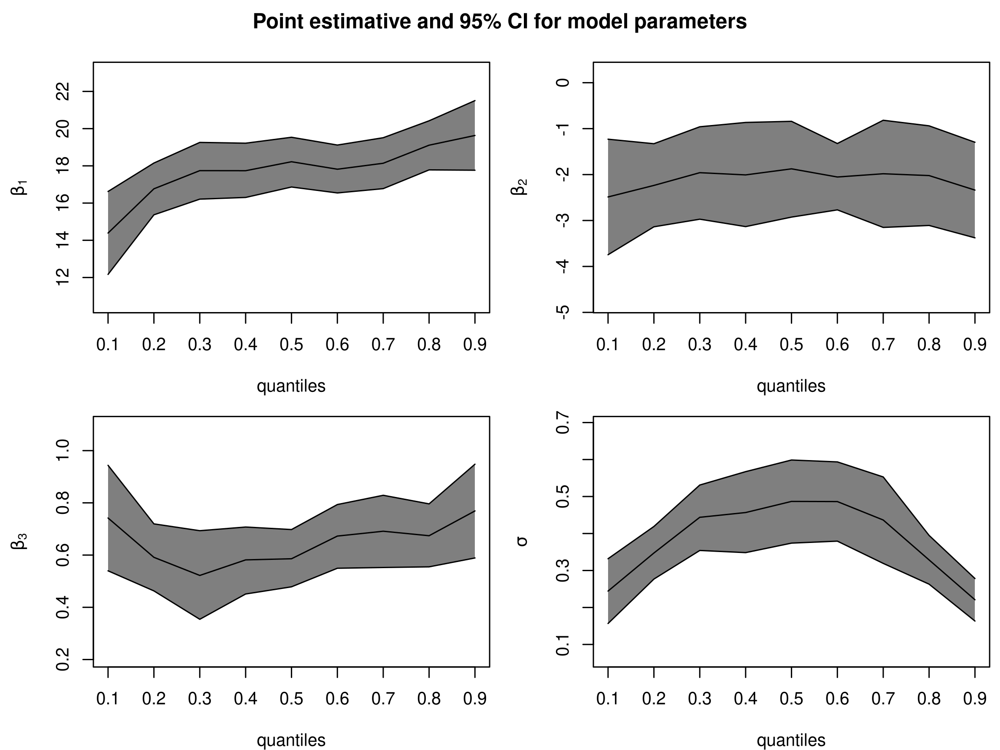

```{r setup, include=FALSE}
knitr::opts_chunk$set(warning = FALSE, message = FALSE, fig.align = "center", out.width="65%")

library(ggplot2)
library(latex2exp)
library(qrLMM)
library(lqmm)
library(dplyr)
library(purrr)
library(RefManageR)
library(glue)
library(quantreg)
library(kableExtra)

bib <- ReadBib("bib.bib")

BibOptions(max.names = 2L, bib.style = "authoryear", check.entries = FALSE)

theme_set(theme_bw())
```

# Regressão quantílica

<style>
.reveal .sourceCode.r .kw, .sourceCode.r .er {
  color:inherit;
  font-weight: normal;
}
.reveal .sourceCode.r .co {
  font-style: normal;
}

.reveal .slides {
  text-align: inherit;
}

.reveal .slide.level2 h1 {
  font-size: 48px;
}

.reveal pre code {
  font-size: 20px;
  line-height: 1.3;
}
</style>


## Definição de Quantil

- Qualquer variável aleatória pode ser caracterizada pela sua função de distribuição acumulada $F(y) = P(Y \leq y)$;
- O p-ésimo quantil é definido como
\[F^{-1}(p) = \inf \{y: F(y) \geq p\} = Q(p)\]
- O quantil é uma medida de posição
- O p-ésimo quantil é obtido resolvendo
\[\min_{\xi \in \mathbb{R}} \sum _{i=1}^ n \rho_p(y_i - \xi),\]

onde $\rho_p(u) = u(p - I\{u < 0\})$ é uma função de perda.

## Função de perda

<p align="center">
  
</p>

## Regressão Quantílica

- Na regressão quantílica, é possível caracterizar toda a distribuição condicional da variável resposta;
- Robusta a valores discrepantes;
- É possível estudar mais afundo os extremos de uma população;
- O $\tau$-ésimo quantil condicional denotado por $Q_y(\tau|\boldsymbol{x}) = \boldsymbol{x}' \boldsymbol \beta(\tau)$ pode ser estimado por $\boldsymbol{x}' \hat {\boldsymbol \beta}(\tau)$, em que
\[(\hat \beta_1(\tau), \dots, \hat \beta_p(\tau))' = \arg \min_{\beta \in \mathbb R^p} \sum _{i=1}^ n \rho_p(y_i - \boldsymbol{x}_i' \boldsymbol \beta)\]

## Exemplo de robustez da regressão quantílica

Dados de 235 observações sobre o gasto em alimentação e renda em casas Belgas.

```{r}
data("engel")

engel
```

## Exemplo de robustez da regressão quantílica

Gasto em comida muito acima dos demais
```{r}
engel %>% filter(foodexp > 2000)
```

Criando um valor discrepante e criando os modelos em que o gasto em alimentação é explicado pela renda nos dados com e sem o valor discrepante.

```{r}
engel_o <- engel %>% mutate(foodexp = ifelse(foodexp > 2000, 99999, foodexp))

lm1 <- lm(foodexp ~ income, data = engel)
lm2 <- lm(foodexp ~ income, data = engel_o)

rq1 <- rq(foodexp ~ income, tau = .5, data = engel)
rq2 <- rq(foodexp ~ income, tau = .5, data = engel_o)
```
## Exemplo de robustez da regressão quantílica

Comparando o valor dos coeficientes

```{r}
cbind(coef(lm1), coef(lm2), coef(rq1), coef(rq2)) %>%
  kbl(col.names = rep(c("Sem Outlier", "Com Outlier"), 2)) %>%
  add_header_above(c(" " = 1, "Mínimos Quadrados" = 2, 
                     "Regressão Quantílica" = 2))
```


# Regressão Quantílica em modelos mistos

## Distribuição Laplace Assimétrica (ALD)

$Y$ possui distribuição $\mbox{ALD}(\mu, \sigma, p)$, com função de densidade
\[f(y|\mu, \sigma, p) = \frac{p(1-p)}{\sigma} \exp 
\left\{ 
-\rho_p \left ( \frac{y - \mu}{\sigma}\right)
\right\}\]

- $\mu \in R$ é o parâmetro de locação;
- $\sigma > 0$ é o parâmetro de escala;
- $p \in (0, 1)$ é o parâmetro de assimetria;

## Distribuição Laplace Assimétrica (ALD)

Uma propriedade da distribuição ALD é que $P(Y \leq \mu) = p$.

Segundo `r Citet(bib, "lqmm")` para um $p$ fixo, a p-ésima regressão quantílica é estimada do modelo

\[y_i = \mu_i (p) + \epsilon_i (p), \qquad i = 1, \dots, M,\]

onde $\mu_i (p) = \boldsymbol{x_i' \beta}(p)$ e $\epsilon_i (p) \sim ALD(0, \sigma, p).$ A suposição de distribuição ALD é auxiliar e não é assumido que $F_{y_i|\boldsymbol x_i}$ é verdadeiramente ALD.

## Parâmetro de assimetria da ALD

```{r echo=FALSE}
rho_tau <- function(u, tau) {
  u * (tau - (u < 0))
}

dald <- function(y, mu, sigma, p) {
  u <- (y - mu) / sigma
  p * (1 - p) / sigma * exp(-rho_tau(u, p))
}

taus <- c(.1, .25, .5, .83)

ggplot() +
  {
    map(
      taus,
      ~ geom_function(aes(color = glue("ALD(0, 1, {.x})")),
        size = 3,
        fun = dald, args = list(mu = 0, sigma = 1, p = .x)
      )
    )
  } +
  lims(x = c(-4, 4)) +
  labs(y = "Densidade", color = NULL) +
  theme(
    legend.position = c(.15, .9),
    text = element_text(size = 15, face = "bold"),
    legend.background = element_blank(),
    legend.key = element_blank()
  )
```

## Regressão quantílica em modelos mistos

O modelo apresentado por `r Citet(bib, "qrlmm")` para o $p$-ésimo quantil condicional da variável resposta $y_{ij}$ é definido como:
\[Q_p(y_{ij}|\boldsymbol{x_{ij}, b_i}) = \boldsymbol x_{ij}^T \boldsymbol \beta_p + \boldsymbol{z_{ij} b_i}\]

para $i = 1, \dots, n$ e $j = 1, \dots, n_i$


- $y_{ij}$ é a $j$-ésima medida do $i$-ésimo sujeito
- $x_{ij}$ é um vetor de dimensão $1 \times k$
- $\boldsymbol{z_{ij}}$ é um vetor de dimensão $q \times 1$
- $Q_p$ é a função inversa de uma distribuição desconhecida $F(\cdot)$
- $\boldsymbol \beta_p$ é o coeficiente de regressão dos efeitos fixos para o p-ésimo quantil com dimensão $k \times 1$
- $\boldsymbol b_i$ são os efeitos aleatórios com distribuição $\boldsymbol b_i \sim N_q(\boldsymbol{0, \Psi})$

## Regressão quantílica em modelos mistos

Segundo `r Citet(bib, "qrlmm")` o resíduo tem uma distribuição $\mbox{ALD}(0, \sigma, p)$, e $y_{ij}| \boldsymbol b_i$ são independentes com distribuição ALD com densidade
\[f(y|\mu, \sigma, p) = \frac{p(1-p)}{\sigma} \exp 
\left\{ 
-\rho_p \left ( \frac{y - 
\boldsymbol x_{ij}^T \boldsymbol \beta_p - \boldsymbol{z_{ij} b_i}}{\sigma}\right)
\right\}\]

Na literatura existe diversas sugestões de estimação de $\boldsymbol \beta, \boldsymbol b_i \mbox{ e } \sigma$.

- `r Citet(bib, "qrlmm")` Propuseram o algoritmo SAEM.
- `r Citet(bib, "lqmm")` Propôs o método do gradiente.

# Pacote `qrLMM`

- Ajusta modelo de regressão quantílica utilizando algoritmo Stochastic-Approximation of the EM Algorithm (SAEM) para um único quantil
- Basicamente só possui a função `QRLMM`
    - Não possui método `predict()`, `summary()`, `print()`

Argumentos da função `QRLMM(y,x,z,groups,p=0.5)`:

- `y` é o vetor resposta de dimensão $N$
- `x` é a matriz de delineamento com os efeitos fixos de dimensão $N \times k$
- `z` é a matriz de delineamento com os efeitos aleatórios de dimensão $N \times q$
- `groups` fator definindo a partição dos efeitos aleatórios de dimensão $N$
- `p` define o quantil ajustado

## Exemplo com o banco de dados `Orthodont`

Dados referentes a medidas ortodônticas em crianças.

```{r}
data("Orthodont")

Orthodont$Subject <- factor(
  Orthodont$Subject,
  sort(unique(as.character(Orthodont$Subject)))
)

Orthodont
```


## Exemplo dos autores

Vamos ajustar o modelo
\[Q(y_{ij}|b_i, x_{ij}) = (\beta_0 + b_{i0}) + \beta_1 sex_i+ (\beta_2 + b_{i1}) Age_{ij},\]
para $i = 1, \dots, 27$ e $j = 1, \dots, 4$

```{r}
y <- Orthodont$distance # resposta
# Matriz de delineamento para os efeitos fixos
x <- model.matrix(~ Sex + age, data = Orthodont)
# Matriz de delineamento para os efeitos aleatórios
z <- model.matrix(~age, data = Orthodont)
groups <- Orthodont$Subject
```

## Ajuste do modelo para os percentis utilizando o pacote `qrLMM`

```{r qurtile-fit, cache=TRUE, fig.show='hide'}
taus <- seq(.10, .90, .1)

fit_qrlmm <- QRLMM(y, x, z, groups,
  p = taus, MaxIter = 10,
  show.convergence = FALSE
)
```

## Gráfico de ajuste

<p align="center">
  
</p>


## Predição para `QRLMM`

Os autores não definiram um método `predict`, por isso foi feita uma função baseada no exemplo da função `QRLMM`.

```{r}
predict_qrlmm <- function(model, x, z = NULL, groups = NULL) {
  beta <- model$res$beta # fixed effects
  weights <- model$res$weight # random weights
  fixed <- tcrossprod(x, t(beta))
  random <- rep(0, dim(x)[1]) # initializing random shift

  if (!(is.null(z) || is.null(groups))) {
    nj <- c(as.data.frame(table(groups))[, 2]) # obs per subject
    for (j in 1:length(nj)) {
      z1 <- matrix(z[(sum(nj[1:j - 1]) + 1):(sum(nj[1:j])), ],
        ncol = dim(z)[2]
      )

      random[(sum(nj[1:j - 1]) + 1):(sum(nj[1:j]))] <-
        tcrossprod(z1, t(weights[j, ]))
    }
  }

  pred <- fixed + random # predictions

  pred
}
```

- As predições ditas em nível 1 se referem aos indivíduos $(\boldsymbol{X \beta + Z b})$
- As predições em nível 0 se referem a população $(\boldsymbol{X \beta})$

```{r}
pred_qrlmm_1 <- sapply(fit_qrlmm, predict_qrlmm, x, z, groups)
pred_qrlmm_0 <- sapply(fit_qrlmm, predict_qrlmm, x)

colnames(pred_qrlmm_0) <- taus
colnames(pred_qrlmm_1) <- taus
```

```{r include=FALSE}
update_geom_defaults("line", list(size = 1.2))
theme_update(legend.position = "bottom")
```

## Estimativas por indivíduo

```r
tau_plot <- c(.1, .5, .9)

idx_tau <- taus %in% tau_plot

gline_tau <- function(valor, nome) {
  tau_perc <- scales::percent(as.numeric(nome))
  geom_line(aes(y = valor, color = tau_perc))
}

ggplot(Orthodont, aes(age, distance)) +
  geom_line() +
  {
    purrr::imap(
      as_tibble(pred_qrlmm_1)[, idx_tau],
      gline_tau
    )
  } +
  facet_wrap(~Subject) +
  labs(color = NULL)
```

## Estimativas por indivíduo

```{r echo=FALSE}
tau_plot <- c(.1, .5, .9)

idx_tau <- taus %in% tau_plot

gline_tau <- function(valor, nome) {
  tau_perc <- scales::percent(as.numeric(nome))
  geom_line(aes(y = valor, color = tau_perc))
}

ggplot(Orthodont, aes(age, distance)) +
  geom_line() +
  {
    purrr::imap(
      as_tibble(pred_qrlmm_1)[, idx_tau],
      gline_tau
    )
  } +
  facet_wrap(~Subject) +
  labs(color = NULL)
```

## Estimativas populacionais por sexo

```r
ggplot(Orthodont, aes(age, distance, group = Subject)) +
  geom_line(alpha = .3, linetype = 2) +
  {
    purrr::imap(
      as_tibble(pred_qrlmm_0)[, idx_tau],
      gline_tau
    )
  } +
  facet_wrap(~Sex) +
  theme(legend.position = "bottom") +
  labs(color = NULL)
```

## Estimativas populacionais por sexo

```{r echo=FALSE}
ggplot(Orthodont, aes(age, distance, group = Subject)) +
  geom_line(alpha = .3, linetype = 2) +
  {
    purrr::imap(
      as_tibble(pred_qrlmm_0)[, idx_tau],
      gline_tau
    )
  } +
  facet_wrap(~Sex) +
  theme(legend.position = "bottom") +
  labs(color = NULL)
```


# Pacote `lqmm`

- Ajusta modelo de regressão quantílica utilizando o método do gradiente

Argumentos da função `lqmm(fixed, random, group, tau = 0.5)`:

- `fixed` fórmula para os efeitos fixos
- `random` fórmula para os efeitos aleatórios
- `group` fator definindo a partição dos efeitos aleatórios de dimensão $N$
- `tau` define o quantil ajustado

## Ajuste do modelo para os quartis utilizando o pacote `lqmm`

```{r}
fit.lqmm <- lqmm(distance ~ Sex + age,
  random = ~age, group = Subject,
  tau = taus, data = Orthodont
)

cov_mat <- summary(fit.lqmm, covariance = TRUE)
cov_mat
```

## Efeitos Fixos

```{r}
coef(fit.lqmm) %>% kbl()
```


```{r, include=FALSE}
coefs_lqmm <- coef(fit.lqmm)
r_ou_a <- function(x) if(x<0) "reduz" else "aumenta"
```

<br><br>

- A distância da glândua pituritária até fissura pterigomaxilar é inferior para as meninas em todos os quantis estudados.
- O envelhecimento de um ano `r r_ou_a(coefs_lqmm["age", "0.5"])` a distância mediana em `r round(coefs_lqmm["age", "0.5"], 2)` milímetros.

## Efeitos aleatórios

```{r}
nome_ra <- colnames(ranef(fit.lqmm)[[1]])
ha_ <- set_names(rep_len(length(nome_ra), sum(idx_tau)), tau_plot)
bind_cols(ranef(fit.lqmm)[idx_tau]) %>%
  head(15) %>%
  kbl(digits = 4, col.names = rep(nome_ra, sum(idx_tau))) %>%
  add_header_above(c(" " = 1, ha_))
```


## Gráfico dos efeitos fixos por quantil


```{r eval=FALSE, include=FALSE}
n_beta <- nrow(coef(fit.lqmm))

ep_betas <- apply(cov_mat[["Cov"]], c(3), function(x) {
  sqrt(diag(x)[seq_len(n_beta)])
})

lapply(seq_len(n_beta), function(i) {
  est <- coef(fit.lqmm)[i, ]
  ep <- ep_betas[i, ]
  epz <- qnorm(.975) * ep
  li <- est - epz
  ls <- est + epz
  ggplot(mapping = aes(taus, est)) +
    geom_ribbon(aes(ymin = li, ymax = ls), fill = "grey70") +
    geom_point() +
    geom_line()
})

```


```{r, out.width="40%"}
est_tau <- imap(as_tibble(t(coef(fit.lqmm))), ~{
  qplot(taus, .x, geom = "line") +
    scale_x_continuous(n.breaks = 10, labels = scales::percent) +
  labs(x = TeX("$\\tau$"), y = "Estimativa", title = .y)
})
cowplot::plot_grid(plotlist = est_tau, ncol = 1)
```

- O gráfico acima nos mostra como os coeficientes variam com o quantil.
- No geral os coeficientes variaram pouco.

## Predição para `lqmm`

- Para definir se o ajuste é para indivíduo ou para a população utiliza o argumento `level` na função `predict`.

```{r}
# Estimativa populacional
pred_lqmm_0 <- predict(fit.lqmm, level = 0)
# Estimativa individual
pred_lqmm_1 <- predict(fit.lqmm, level = 1)
```

## Estimativas por indivíduo

```{r, echo=FALSE}
ggplot(Orthodont, aes(age, distance)) +
  geom_line() +
  {
    purrr::imap(
      as_tibble(pred_lqmm_1)[, idx_tau],
      gline_tau
    )
  } +
  facet_wrap(~Subject) +
  labs(color =  NULL)
```

## Estimativas populacionais por sexo

```{r, echo=FALSE}
ggplot(Orthodont, aes(age, distance, group = Subject)) +
  geom_line(alpha = .3, linetype = 2) +
  {
    purrr::imap(
      as_tibble(pred_lqmm_0)[, idx_tau],
      gline_tau
    )
  } +
  facet_wrap(~Sex) +
  labs(color = NULL)
```


<!-- ## Comparação de ajuste -->

```{r eval=FALSE, include=FALSE}
purrr::map_df(list(
  "qrLMM Nível 0" = pred_qrlmm_0,
  "qrLMM Nível 1" = pred_qrlmm_1,
  "lqmm Nível 0" = pred_lqmm_0,
  "lqmm Nível 1" = pred_lqmm_1
), function(pred) {
  res <- sapply(pred, function(x) {
    y - x
  })
  erro <- colMeans(sapply(taus, rho_tau, u = res))
  names(erro) <- taus
  erro
}, .id = "Método")
```


# Referências

```{r refs, echo=FALSE, results='asis'}
NoCite(bib, "lqmm")
PrintBibliography(bib)
```
